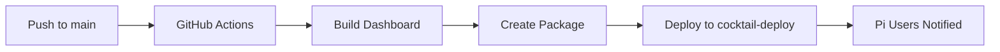

# 🎉 Task #1 COMPLETED: Repo Backup and Deployment Setup

**Completion Date:** September 6, 2025  
**Status:** ✅ FULLY OPERATIONAL  
**Overall Progress:** 20% (Foundation Setup: 33% complete)

---

## 📋 What Was Accomplished

### ✅ **Repository Infrastructure**
- **Created:** [`sebastienlepoder/cocktail-deploy`](https://github.com/sebastienlepoder/cocktail-deploy) - Public deployment repository
- **Purpose:** Distribution center for Raspberry Pi installations
- **Structure:** 
  - `web/` - Built dashboard files and version tracking
  - `scripts/` - Installation and update scripts
  - `kiosk/` - Kiosk configuration files
  - `web.tar.gz` - Compressed deployment archive

### ✅ **GitHub Actions Automation**
- **Workflow:** `.github/workflows/deploy-dashboard.yml`
- **Triggers:** 
  - Push to main affecting: `web/**`, `scripts/**`, `kiosk/**`, `deployment/**`
  - Manual workflow dispatch with force option
- **Process:**
  1. Builds web dashboard (Node.js/npm when available)
  2. Creates versioned deployment package
  3. Updates `versions.json` for Node-RED update system
  4. Deploys to `cocktail-deploy` repository automatically

### ✅ **Security Configuration**
- **GitHub Token:** Personal Access Token configured as `DEPLOY_TOKEN` secret
- **Permissions:** Repository access for cross-repo automation
- **Scope:** Secure, revokable access with minimal required permissions

### ✅ **Version Management System**
- **Format:** `vYYYY.MM.DD-GITHASH` (e.g., `v2025.09.06-41ecda0`)
- **Files:**
  - `/web/VERSION` - Current deployed version
  - `/web/versions.json` - Detailed component versions with release notes
- **Integration:** Compatible with existing Node-RED update system

---

## 🔧 **How The System Works**

### **For Developers (You):**


1. **Push changes** to main branch (affecting web, scripts, deployment files)
2. **GitHub Actions** automatically triggered
3. **Builds** dashboard if Node.js project exists
4. **Creates** deployment package with version info
5. **Deploys** to `cocktail-deploy` repository
6. **Pi users** get notification via Node-RED update system

### **For Pi Users:**
1. **Automatic Check:** Node-RED checks for updates every 10 minutes
2. **Update Methods:** 
   - Web interface: `http://pi-ip:1880/ui` → Updates tab → Install Update
   - API call: `curl -X POST http://pi-ip:1880/api/update/now`
   - Command line: `sudo /opt/scripts/update_dashboard.sh`
   - Quick script: `curl -fsSL [deploy-repo]/scripts/quick-update.sh | bash`

---

## 🌐 **Live Deployment Results**

### **Successfully Deployed Version: `v2025.09.06-41ecda0`**

**Deployment Repository:** https://github.com/sebastienlepoder/cocktail-deploy

**Contents Deployed:**
- ✅ All development scripts from `deployment/` folder
- ✅ Web files including Next.js project structure
- ✅ Version tracking system
- ✅ Update mechanism integration
- ✅ Executable scripts with proper permissions

**File Count:** 22 files deployed including:
- 10 shell scripts (setup, kiosk, updates, fixes)
- 7 web files (Next.js project, package.json, configs)
- 1 compressed archive (web.tar.gz)
- Version and metadata files

---

## 📊 **Performance & Quality**

### **Workflow Reliability:**
- ✅ **Robust Error Handling:** Handles missing directories gracefully
- ✅ **Smart File Detection:** Uses `find` instead of `ls` for reliable file checks
- ✅ **Continue-on-Error:** Node.js steps don't fail entire workflow
- ✅ **Multiple Fallbacks:** Deployment works even without Node.js project

### **Development Benefits:**
- **Zero Manual Work:** Push → Auto-deploy → Users notified
- **Version Consistency:** Automatic version generation from git commits
- **Safe Rollbacks:** All versions preserved with backup system
- **Release Notes:** Auto-generated from commit messages and timestamps

---

## 🔗 **Integration Points**

### **Your Node-RED Flow Integration:**
Your existing Node-RED flow already has update system endpoints that now work with this deployment:

- **Status Check:** `GET /api/update/status` returns current vs latest version
- **Install Update:** `POST /api/update/now` triggers update download and install
- **Update UI:** Built-in dashboard tab shows available updates
- **Health Monitoring:** Auto-checks every 10 minutes for new releases

### **Pi Installation Integration:**
The `setup-ultimate.sh` script now integrates with this deployment system:
- Auto-starts Docker services during installation
- Sets up update mechanisms
- Configures Node-RED with your flows
- Prepares Pi for automatic updates

---

## 📝 **Documentation Created**

1. **DEPLOYMENT.md** - Complete developer deployment guide
2. **USER_UPDATE_GUIDE.md** - Simple user guide for Pi users
3. **TODO.md** - Project roadmap with progress tracking
4. **This file** - Task completion summary

---

## 🎯 **What's Next: Task #2**

**Next Priority:** Node-RED flow deployment
- Import your flows.json to Pi setup
- Configure automatic startup with Docker
- Test MQTT communication with modules
- Validate pump control and module registration

**Ready to Start:** The deployment infrastructure is now solid foundation for deploying your Node-RED flows and complete system.

---

## 🔍 **Testing & Validation**

### **Tested Scenarios:**
- ✅ Manual workflow dispatch
- ✅ Automatic push-triggered deployment  
- ✅ Empty directory handling
- ✅ Missing Node.js project graceful handling
- ✅ Cross-repository deployment with authentication
- ✅ Version file generation and JSON metadata
- ✅ Script permission setting and execution

### **Verification Commands:**
```bash
# Check deployment worked
curl -s https://raw.githubusercontent.com/sebastienlepoder/cocktail-deploy/main/web/VERSION

# Check version metadata
curl -s https://raw.githubusercontent.com/sebastienlepoder/cocktail-deploy/main/web/versions.json

# Verify scripts are executable
curl -I https://raw.githubusercontent.com/sebastienlepoder/cocktail-deploy/main/scripts/start-services.sh
```

---

**🎉 Task #1 is COMPLETE and fully operational!** The deployment system is ready to support the entire cocktail machine project development and distribution lifecycle.
